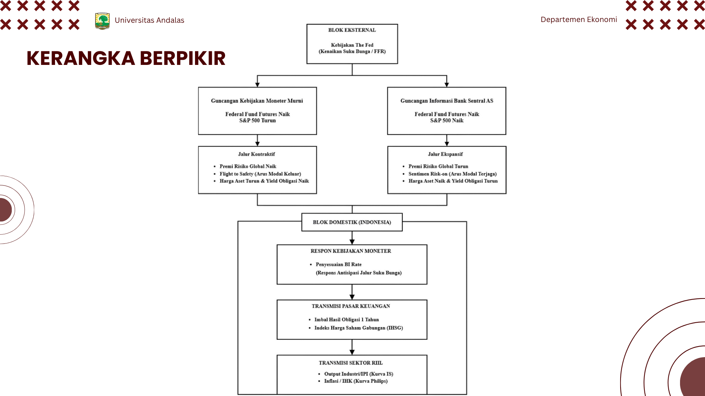
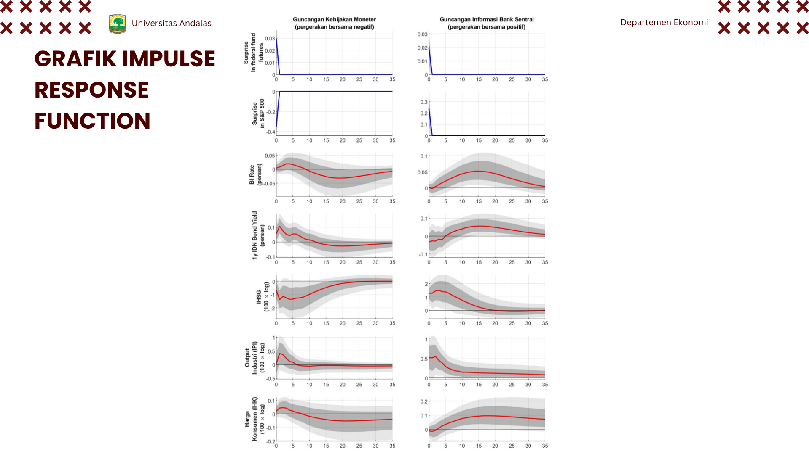
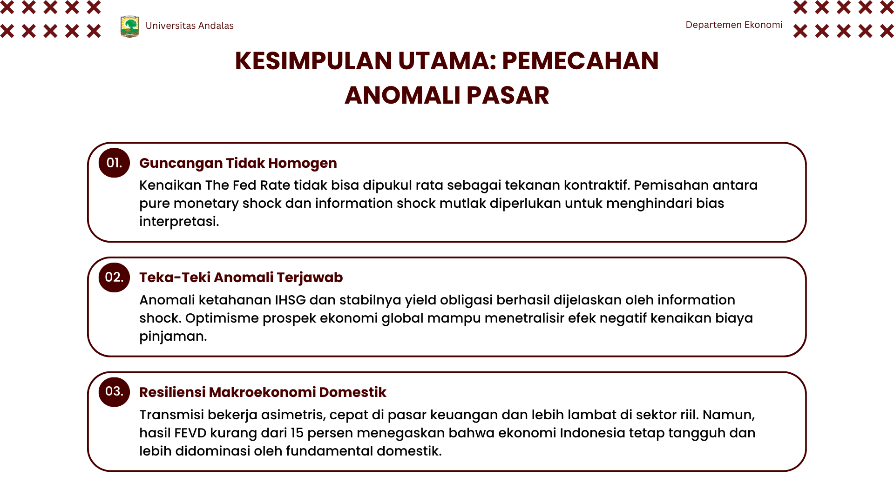

## Sumber Data & Atribusi Kode
Proyek ini mengaplikasikan metodologi dan basis kode dari literatur ekonomi makro terkemuka, yang kemudian disesuaikan untuk memasukkan variabel makroekonomi Indonesia:
* **Data Guncangan Eksternal:** Data instrumen frekuensi tinggi (Federal Fund Futures dan S&P 500) bersumber dari repositori GitHub Marek Jarociński.
* Data ini telah digabungkan dengan variabel domestik.
* **Data Domestik Indonesia:** (BI Rate, yield obligasi pemerintah Indonesia tenor 1 tahun, Indeks Harga Saham Gabungan (IHSG), Indeks Produksi Indonesia (IPI), Indeks Harga Konsumen (IHK)) bersumber dari Bank Indonesia, Badan Pusat Statistik (BPS), dan Investing.com.
* **Basis Kode Estimasi:** Repositori ini mengadaptasi *script* MATLAB BSVAR yang disediakan dalam paket replikasi *American Economic Journal: Macroeconomics* (Jarociński & Karadi, 2020). Modifikasi dilakukan pada parameter estimasi dan input matriks agar sesuai dengan dinamika perekonomian Indonesia. 

**Catatan Lisensi (© 2020 American Economic Association):**
* Penggunaan *script* dan perangkat lunak turunan dalam repositori ini tunduk pada *Modified BSD License*.
* Penggunaan basis data turunan dilisensikan di bawah *Creative Commons Attribution 4.0 International Public License*.
Silakan merujuk pada dokumen `LICENSE` di repositori ini untuk detail selengkapnya.

## Metodologi
Analisis dilakukan menggunakan pendekatan **Bayesian Structural Vector Autoregression (BSVAR)** dengan identifikasi **Sign Restrictions**. Berikut adalah alur kerangka berpikir transmisi guncangan yang diuji dalam riset ini:

  

## Temuan Utama (*Key Findings*)
Berikut adalah hasil ekstraksi visual dari *Impulse Response Function* (IRF) yang menunjukkan respons asimetris perekonomian Indonesia terhadap dua jenis guncangan The Fed:

  

Berdasarkan analisis IRF dan dekomposisi varians, berikut adalah kesimpulan utama yang sekaligus menjawab anomali ketahanan pasar keuangan domestik:

  

